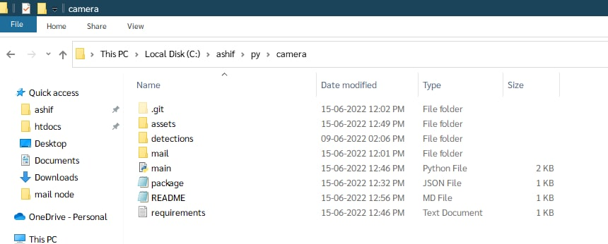
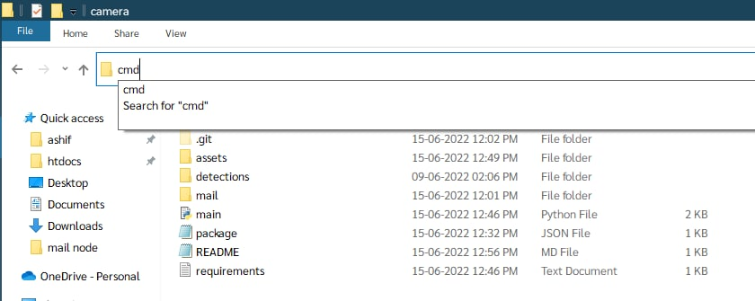

<details>
<summary>
STEP 0 - README FIRST
</summary>
all the code will be written for Windows operating system (OS) only.
</details>

# Step 1 - Instalation of Project

- ### Python

    [Python (v3.9.13) - 64 bit Installer](https://www.python.org/ftp/python/3.9.13/python-3.9.13-amd64.exe)

    [Python (v3.9.13) - 32 bit Installer](https://www.python.org/ftp/python/3.9.13/python-3.9.13.exe)
- ### Node.js
  

    [Node.js (v16.15.1) - 64 bit Installer](https://nodejs.org/dist/v16.15.1/node-v16.15.1-x64.msi)

    [Node.js (v16.15.1) - 32 bit Installer](https://nodejs.org/dist/v16.15.1/node-v16.15.1-x86.msi)

# Step 2 - Requirements Instalation
- ### Python
  
    open cmd or powershell then paste 

    ```
    pip install -r requirements.txt
    ```
    or

    ```
    python -m pip install -r requirements.txt
    ```
- ### Node.js

    open cmd or powershell **on the directory where the python file is exit** then paste 

    ```
    cd mail && npm install
  ```

# Step 3 - Run the Project

## Paste this (make sure all instalation is completed)

open **two** cmd or powershell on the directory where the python file is exit
<p style='text-align: center;'>
    
    
</p>


## Step 3.1 - 1st terminal window

```
python3 main.py
```
or 
```
python main.py
```
## Step 4.2 - 2nd terminal window
```
npm start
```

Thats all !

Happy Coding !